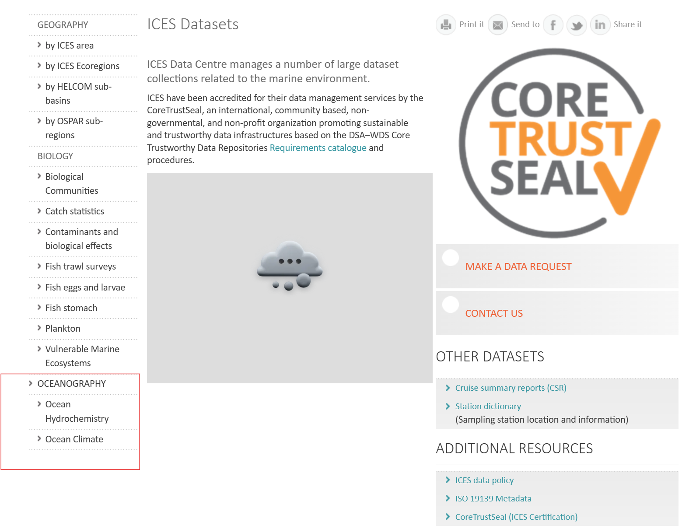

# QB2025-Project
Study on the effect of climate change on biodiveristy of macrozoobenthos in the Baltic sea

> **Note**: This is R project for biodiversity BIOL Z620 in Spring 2025

---

## Table of Contents
- [QB2025-Project](#qb2025-project)
  - [Table of Contents](#table-of-contents)
  - [Motivation](#motivation)
  - [Environmental Variables](#environmental-variables)
    - [Data sources](#data-sources)
  - [Data preparation](#data-preparation)
  - [Codes](#codes)

## Motivation
The Baltic Sea is a unique and ecologically important marine ecosystem that supports a diverse array of species, including macrozoobenthos. These benthic organisms play a crucial role in the Baltic Sea food web and ecosystem functioning, contributing to nutrient cycling, sediment stability, and providing food for higher trophic levels. However, the Baltic Sea is facing numerous environmental challenges, including climate change, pollution, and habitat degradation, which are impacting the biodiversity and abundance of macrozoobenthos species. Understanding the temporal and spatial patterns of species richness, community composition, and environmental drivers of macrozoobenthos in the Baltic Sea is essential for monitoring ecosystem health, predicting future changes, and informing conservation and management strategies. This project aims to analyze time series data on macrozoobenthos and environmental variables in the Baltic Sea to investigate the effects of climate change on biodiversity and community dynamics. 

**Why study species richness over time?**
Species richness reflects biodiversity, and studying its temporal pattern allows us to understand the stability or fluctuations in biodiversity.

**Why study changes across sites?**
The Baltic Sea is known for its varying environmental conditions. Species richness may respond differently at each site depending on the environmental conditions. Understanding these temporal changes in species richness across multiple sites provides insights into local ecological health and resilience. Identifying trends, peaks, or declines can help assess how disturbances, whether natural or anthropogenic, are affecting biodiversity at each site.

## Environmental Variables

| **Variable**                                  | **Unit**       | **Why Important**                                                                                           |
|-----------------------------------------------|---------------|-------------------------------------------------------------------------------------------------------------|
| **Bot. Depth**                                | m             | Represents the bottom depth of the water, which influences habitat conditions and species distribution.   |
| **Secchi Depth**                              | m             | Measures water clarity and light penetration, affecting photosynthesis and primary production.              |
| **Depth (ADEPZZ01_ULAA)**                     | m             | Indicates the sampled water depth,|
| **Temperature (TEMPPR01_UPAA)**               | °C            | Affects metabolic rates, chemical reactions, and species distribution in aquatic ecosystems.               |
| **Salinity (PSALPR01_UUUU)**                  | unitless      | Determines species composition, affects water density, and influences ocean circulation.                   |
| **Oxygen (DOXYZZXX_UMLL)**                    | ml/l          | Essential for marine life                                 |
| **Phosphate (PHOSZZXX_UPOX)**                 | µmol/l        | Key nutrient for phytoplankton growth                      |
| **Total Phosphorus (TPHSZZXX_UPOX)**          | µmol/l        | Includes all phosphorus forms, indicating overall nutrient availability      |
| **Silicate (SLCAZZXX_UPOX)**                  | µmol/l        | Necessary for diatom growth, influencing primary production and food web dynamics.                         |
| **Nitrate + Nitrite (NTRZZZXX_UPOX)**         | µmol/l        | Indicator of nutrient load and potential eutrophication, impacting oxygen levels.                          |
| **Nitrate (NTRAZZXX_UPOX)**                   | µmol/l        | Major nitrogen source for phytoplankton growth                             |
| **Nitrite (NTRIZZXX_UPOX)**                   | µmol/l        | Intermediate in nitrogen cycling                   |
| **Ammonium (AMONZZXX_UPOX)**                  | µmol/l        | Readily available nitrogen source for phytoplankton           |
| **Total Nitrogen (NTOTZZXX_UPOX)**            | µmol/l        | Sum of all nitrogen forms, reflecting overall nutrient availability and ecosystem productivity.            |
| **Hydrogen Sulfide (H2SXZZXX_UPOX)**          | µmol/l        | Indicates anoxic conditions; toxic to marine life and influences redox chemistry.                          |
| **pH (PHXXZZXX_UUPH)**                        | pH units      | Affects carbonate chemistry, species survival, and ocean acidification.                                    |
| **Total Alkalinity (ALKYZZXX_MEQL)**          | mEq/l         | Buffers pH changes and is essential for carbonate system stability.                                        |
| **Chlorophyll a (CPHLZZXX_UGPL)**             | µg/l          | Proxy for phytoplankton biomass and primary productivity, indicating ecosystem health.                     |

### Data sources
[Environmental data from NCEI]( https://www.ncei.noaa.gov/access/world-ocean-database-select/bin/dbsearch.pl ) 
[Macrozoobenthos data from OBIS](https://www.eurobis.org/toolbox/en/download/occurrence/dataset/601)

---

## Data preparation
1. **Data Collection**: Collect data from NCEI and OBIS.
   - Download data from OBIS using the following query 
   - Download data from ICES using the query [here](https://www.ices.dk/data/dataset-collections/Pages/default.aspx)
      - Geographic range: Baltic Sea 
      - Temporal range: 1980-2005 
  
## Codes
- `0.dataprep.ipynb` : Data preparation and cleaning for macrozoobenthos and environmental data.
- `1.analysis.ipynb` : Data analysis and visualization for macrozoobenthos and environmental data.
- `2.Spatial_analysis.Rmd` : Spatial analysis of macrozoobenthos data.
- `3.Temporal_analysis.Rmd` : Time series analysis of macrozoobenthos data.
---

  