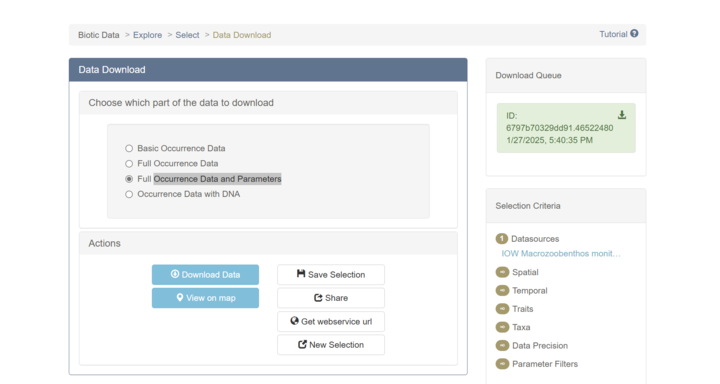
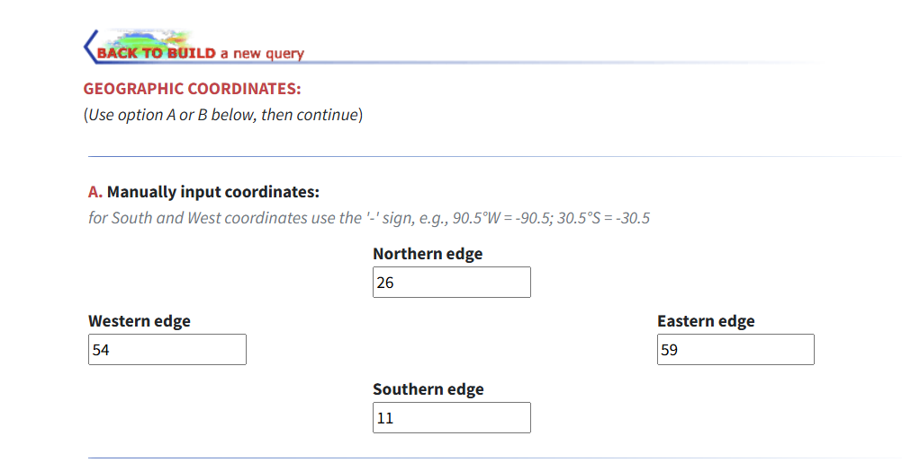
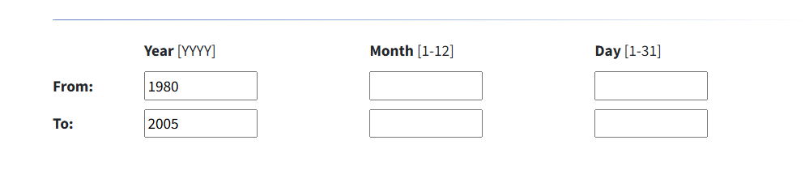

# QB2025-Project
Study on the effect of climate change on biodiveristy of macrozoobenthos in the Baltic sea

> **Note**: This is R project for biodiversity BIOL Z620 in Spring 2025

---

## Table of Contents
- [QB2025-Project](#qb2025-project)
  - [Table of Contents](#table-of-contents)
    - [Data variables](#data-variables)
  - [Evironemental variables](#evironemental-variables)
    - [Data sources](#data-sources)
  - [Data preparation](#data-preparation)
  - [Features](#features)
  - [Code Example](#code-example)


### Data variables
## Evironemental variables
| **Variable**                      | **Unit**       | **Why Important**                                                                                           |
|------------------------------------|----------------|-------------------------------------------------------------------------------------------------------------|
| **Temperature**                   | °C             | Affects metabolic rates, growth, reproduction, and distribution of species.                                 |
| **Salinity**                      | unitless       | Determines species composition due to the Baltic Sea's unique salinity gradient.                            |
| **Oxygen**                        | µmol/kg        | Crucial for survival; low levels (hypoxia) lead to dead zones.                                              |
| **Phosphate**                     | µmol/kg        | Reflects nutrient enrichment and eutrophication, impacting food supply and oxygen levels.                   |
| **Silicate**                      | µmol/kg        | Related to nutrient dynamics, especially diatom abundance, which impacts food availability.                 |
| **Nitrate and Nitrate+Nitrite**   | µmol/kg        | Indicators of nutrient load, eutrophication, and food availability for benthic organisms.                   |
| **pH**                            | unitless       | Affects carbonate chemistry; low pH harms organisms with calcium carbonate shells.                          |
| **Chlorophyll**                   | µg/l           | Proxy for phytoplankton biomass, a key food source for benthic species.                                     |
| **Pressure**                      | dbar           | Reflects depth, influencing oxygen levels, light penetration, and habitat conditions.                       |
| **Dissolved Inorganic Carbon**    | mM             | Indicates carbon chemistry and potential effects of acidification.                                          |
| **Transmissivity**                | 1/m            | Measures water clarity; turbidity impacts benthic photosynthesis and sedimentation.                         |
| **CO₂ warming**                   | °C             | Long-term warming stresses species and shifts distributions.                                                |
|Features to consider:|
| **Alkalinity**                    | meq/l          | Balances pH and carbonate chemistry, essential for calcifying organisms.                                    |
| **Air Temperature**               | °C             | Indirectly influences surface water conditions, especially in shallow regions.                              |
| **Air Pressure**                  | mbar           | Affects surface water conditions indirectly.                                                                |
| **Helium, Argon, Neon**           | nmol/kg        | Indicate gas saturation and reveal hypoxia or upwelling zones.                                              |
| **Chlorofluorocarbon (CFC 11/12)**| pmol/kg        | Act as tracers for water mass movement and age, reflecting habitat stability.                                |


### Data sources
[Environmental data from NCEI]( https://www.ncei.noaa.gov/access/world-ocean-database-select/bin/dbsearch.pl ) 
[Macrozoobenthos data from OBIS](https://www.eurobis.org/toolbox/en/download/occurrence/dataset/601)


---

## Data preparation
1. **Data Collection**: Collect data from NCEI and OBIS.
   - Download data from OBIS using the following query 
   - Download data from NCEI using the query [here](https://www.ncei.noaa.gov/access/world-ocean-database-select/bin/builder.pl)
      - Geographic range: Baltic Sea 
      - Temporal range: 1980-2005 
---
## Features
- **Test 1**
- **Test 2**
- **Test 3**

---

## Code Example
```python
def example():
    print("This is an example.")
```